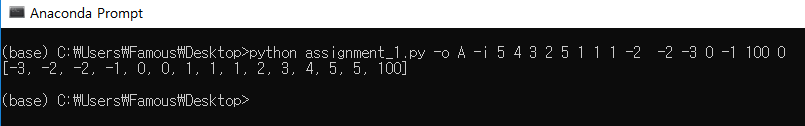

1주차 과제 : Python을 이용한 Quick sort
=============

### 1조 : 유명성(2013040009), 유명성2(2013040009)

* assignment_1.py
  * -o : 정렬 방식, A/오름차순, D/내림차순
  * -i : 정렬할 배열
 
<pre><code>$ python3 assignment_1.py -o A -i 1 2 5 3 6 0 10</code></pre>

### Code 설명

* 퀵정렬 함수...
<pre><code>def quick_sort(list, order)</pre></code>
